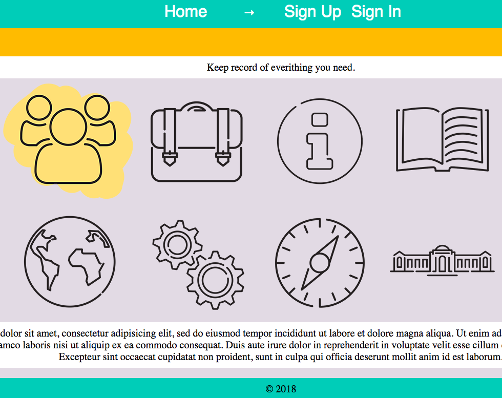

# Calendar

## Home

[Project 1: Calendar](https://limitless-refuge-88831.herokuapp.com/)

Calendar application will help you to keep record of all the events and places that are important.
This project is part of Web Development Immersive at General Assembly Sydney.

## Ruby version

Ruby 2.4.1

## Built with

* HTML

* CSS

* Ruby on Rails

* gem 'bcrypt', '~> 3.1.7'
  gem 'jquery-ui-rails'
  gem 'pry-rails'

## TODO

* Create a calendar which display the events on the exact date.

* Add a google map screen on each place

* Make the page responsible.

* Improve layout.

## License & Copyright

Copyright (c) 2018 Jose Juan Parra Alcolea

Licensed under [MIT License](LICENSE).
